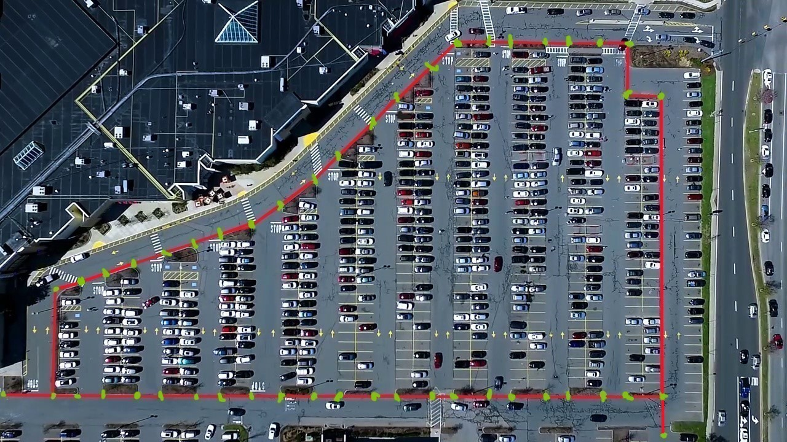

# ParkingNavigation
寻找停车场离当前起点最近的停车位

🔶 **生成道路转折点**

输入一张图片，首先人工标注道路转折点：

运行 `GetRoadPoints.ipynb` 

> 本项目的道路转折点为 `48` 个点

🔶 生成停车位点

使用图像处理划分得到每个停车位的像素位置

> 算上道路转折点共计 `586` 个点

🔶 生成各个点之间的边

运行 `GetRoadPoints.ipynb` 

🔶 汇总所有的点

运行 `GiveId.ipynb`
